<div align="center">

# 🚀 DevSecOps CI/CD Pipeline

### Automated, Security-First Delivery Pipeline for a Containerized Application

[](https://www.jenkins.io/)
[](https://www.docker.com/)
[](https://www.sonarsource.com/products/sonarqube/)
[](https://aquasecurity.github.io/trivy/)
[](https://hub.docker.com/)

**A production-style Jenkins pipeline that builds, scans, and ships a containerized app — with security gates baked in at every stage.**

[Overview](#-overview) • [Architecture](#-pipeline-architecture) • [Tech Stack](#-tech-stack) • [Pipeline Stages](#-pipeline-stages-explained) • [Getting Started](#-getting-started) • [Roadmap](#-roadmap)

</div>

---

## 📖 Overview

This project implements an end-to-end **DevSecOps CI/CD pipeline** using **Jenkins** to automate the build, security-scan, and delivery process for the `linux-tweet-app` container image. It reflects a real-world "shift-left" security approach — instead of treating security as an afterthought, vulnerability and code-quality checks are integrated directly into the pipeline, **before** the image ever reaches a registry.

**Why this project matters:** it demonstrates practical, hands-on experience with the tools most enterprise DevOps/SRE teams rely on daily — Jenkins pipeline-as-code, static code analysis, container image scanning, and automated registry publishing.

---

## 🏗️ Pipeline Architecture

```mermaid
flowchart LR
    A[👨‍💻 Developer Push] --> B[🔧 Jenkins Checkout]
    B --> C[🔍 SonarQube<br/>Code Quality Analysis]
    C --> D[🛡️ OWASP Dependency Check<br/><i>planned</i>]
    D --> E[🐳 Docker Build]
    E --> F[🔒 Trivy Image Scan<br/>HIGH / CRITICAL CVEs]
    F --> G[📦 Push to DockerHub]
    G --> H[✅ Pipeline Success Notification]

    style A fill:#2496ED,color:#fff
    style C fill:#4E9BCD,color:#fff
    style D fill:#999,color:#fff
    style E fill:#2496ED,color:#fff
    style F fill:#1904DA,color:#fff
    style G fill:#0db7ed,color:#fff
    style H fill:#2ea44f,color:#fff
```



---

## 🧰 Tech Stack

| Category | Tool | Purpose |
|---|---|---|
| **CI/CD Orchestration** | Jenkins (Declarative Pipeline) | Automates the entire build → scan → ship workflow |
| **Source Control** | Git / GitHub | Version control & pipeline trigger source |
| **Static Code Analysis** | SonarQube | Detects code smells, bugs, and security hotspots |
| **Dependency Scanning** | OWASP Dependency-Check *(staged for activation)* | Flags vulnerable third-party libraries |
| **Containerization** | Docker | Builds a reproducible, portable app image |
| **Container Security** | Trivy | Scans the built image for HIGH/CRITICAL CVEs |
| **Image Registry** | Docker Hub | Stores and versions the final image (`BUILD_NUMBER` tagged) |

---

## ⚙️ Pipeline Stages Explained

| # | Stage | What It Does |
|---|-------|---------------|
| 1 | **Checkout Code** | Pulls the latest source from the `main` branch of this repository |
| 2 | **SonarQube Analysis** | Runs static analysis against `sonar.projectKey=linux-tweet-app` to catch bugs, smells & vulnerabilities early |
| 3 | **OWASP Dependency Check** *(currently commented out — see [Roadmap](#-roadmap))* | Scans project dependencies for known CVEs and publishes an HTML report |
| 4 | **Docker Build** | Builds the image as `moniv369/linux-tweet-app:<BUILD_NUMBER>` — every build gets a unique, traceable tag |
| 5 | **Trivy Image Scan** | Scans the built image for HIGH/CRITICAL vulnerabilities *(non-blocking today — `exit-code 0`)* |
| 6 | **Docker Push** | Authenticates via Jenkins-managed `dockerhub-creds` and pushes the image to Docker Hub |
| 7 | **Post Actions** | Reports pipeline success/failure status back to the console |

> 💡 **Security-by-design detail:** every image is scanned by Trivy *before* it's pushed to the registry — no unscanned image ever reaches production.

---

## 🔑 Key Highlights (for reviewers)

- ✅ **Pipeline-as-Code** — entire CI/CD workflow defined declaratively in a version-controlled `Jenkinsfile`
- ✅ **Immutable, traceable image tags** — each build tagged with Jenkins' `BUILD_NUMBER`, never `latest`
- ✅ **Shift-left security** — static analysis (SonarQube) and image scanning (Trivy) run *before* deployment
- ✅ **Secrets management** — Docker Hub credentials injected securely via Jenkins credential store (`withDockerRegistry`), never hardcoded
- ✅ **Modular & extensible** — dependency scanning stage is pre-wired and ready to enable

---

## 🚀 Getting Started

### Prerequisites
- Jenkins server with the following plugins: `Pipeline`, `Docker Pipeline`, `SonarQube Scanner`, `HTML Publisher`
- Docker installed on the Jenkins agent
- [Trivy](https://aquasecurity.github.io/trivy/) installed on the Jenkins agent
- A configured SonarQube server + Jenkins integration (`SonarScanner` tool + `SonarQube` server name)
- Docker Hub account with credentials stored in Jenkins as `dockerhub-creds`

### Run It Yourself
```bash
# 1. Clone the repository
git clone https://github.com/MONIV369/DevSecOps-CI-CD-Pipeline.git
cd DevSecOps-CI-CD-Pipeline

# 2. Create a Jenkins Pipeline job pointing to this repo's Jenkinsfile
#    (New Item → Pipeline → Pipeline script from SCM → Git)

# 3. Trigger a build and watch it flow through:
#    Checkout → SonarQube → Docker Build → Trivy Scan → Docker Push
```

---

## 🗺️ Roadmap

- [ ] Enable **OWASP Dependency-Check** stage (currently commented out) for dependency-level vulnerability reporting
- [ ] Make Trivy scan **blocking** (`--exit-code 1`) to fail builds on CRITICAL CVEs
- [ ] Add **SonarQube Quality Gate** wait step to fail fast on code quality issues
- [ ] Add automated **CD stage** — deploy to Kubernetes via Helm/ArgoCD (GitOps)
- [ ] Integrate **Slack/Email notifications** on pipeline success/failure
- [ ] Add **Prometheus + Grafana** monitoring for the deployed application

---

## 👤 Author

**MONIV369**
🔗 [GitHub Profile](https://github.com/MONIV369)

<div align="center">

⭐ If you found this project useful, consider giving it a star!

</div>
